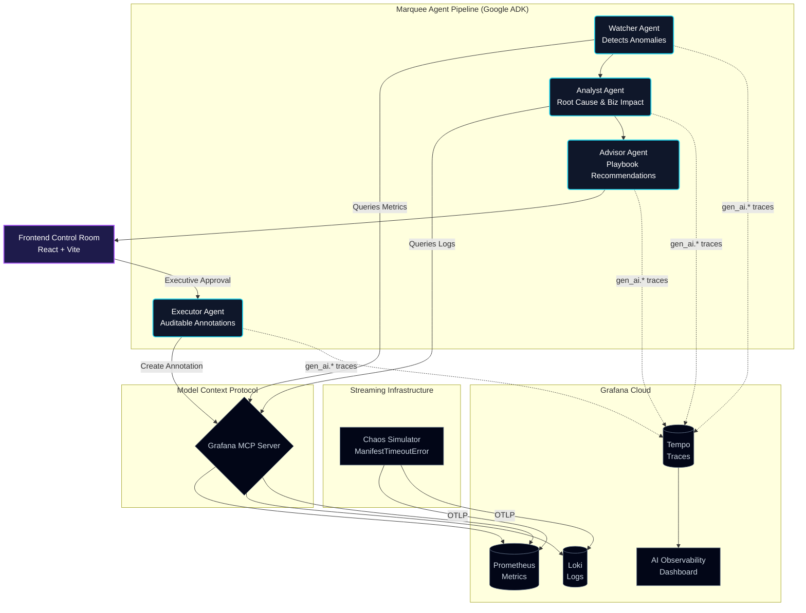

# Marquee: Global Premiere Control Room

> When a blockbuster film drops simultaneously in 190 countries, nobody knows how to translate "the bitrate dropped in São Paulo" to "you're losing 40,000 viewers in your second biggest market and you have eight minutes before it trends on X." **Marquee does.**

Marquee is an AI-driven, highly observable Command Center built for the **Blockbuster Hackathon**. Powered exclusively by **Google Cloud AI** (Gemini 2.5 Pro via the Agent Development Kit) and **Grafana Cloud AI Observability**, Marquee automatically detects infrastructure degradation during global media premieres, translates it into business risk, and executes executive playbooks.

## Architecture



## Features
- **100% Google AI:** Uses Gemini 2.5 Pro via `google.genai` and `google.adk`.
- **Model Context Protocol (MCP):** Connects AI agents directly to Grafana Cloud datasources without custom wrappers.
- **AI Observability:** Implements OpenTelemetry `gen_ai.*` semantic conventions to monitor the LLM's latency, prompt tokens, and costs in Grafana.
- **"Agentic Cinema" Frontend:** A world-class, bento-box UI with glassmorphism, dynamic motion graphics, and a dedicated AI-generated cinematic background.

## Prerequisites
- Python 3.12+
- Node.js 20+
- Google Cloud Project with Gemini API enabled
- Grafana Cloud Account (Metrics, Logs, Traces)

## Installation & Setup

1. **Clone the repository:**
   ```bash
   git clone https://github.com/kasbsquall/marquee.git
   cd marquee
   ```

2. **Environment Variables:**
   Create a `.env` file in the root directory:
   ```env
   GEMINI_API_KEY=your-gemini-key
   GRAFANA_URL=https://your-instance.grafana.net
   GRAFANA_TOKEN=glc_...
   OTLP_ENDPOINT=https://otlp-gateway-prod-us-east-0.grafana.net/otlp
   OTLP_INSTANCE_ID=your-instance-id
   ```

3. **Install Backend Dependencies:**
   ```bash
   pip install -r requirements.txt
   ```

4. **Install MCP Server Globally:**
   ```bash
   npm install -g @grafana/mcp-grafana
   ```

5. **Install Frontend Dependencies:**
   ```bash
   cd frontend
   npm install
   ```

## Running the Project Locally

### 1. Start the Premiere Simulator
Inject realistic metrics and logs (including a simulated CDN failure) into Grafana Cloud via OTLP.
```bash
python telemetry/premiere_simulator.py
```

### 2. Launch the Control Room Frontend
Experience the cinematic executive UI.
```bash
cd frontend
npm run dev
```
Open `http://localhost:5173` in your browser.

### 3. Trigger the Agent Pipeline
Run the backend sequence (Watcher -> Analyst -> Advisor -> Executor) to see the AI interact with Grafana via MCP and generate OTLP traces.
```bash
python run_end_to_end.py
```

## Cloud Run Deployment

Deployment is fully automated using Google Cloud Build and Secret Manager.

1. Authenticate with `gcloud` and set your project:
   ```bash
   gcloud config set project gen-lang-client-0094400410
   ```
2. Run the deployment script (Windows PowerShell):
   ```powershell
   .\deploy.ps1
   ```
   *This script securely uploads your `.env` to Secret Manager and deploys both the backend API and the frontend UI to Cloud Run as unauthenticated services.*

## License
[MIT License](LICENSE)
